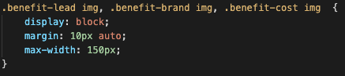

# Code-refactor project

## Links
- URL to the Github repository https://github.com/liza-p/code-refactor
- URL to the deployed application https://liza-p.github.io/code-refactor/

## Previewing locally
This is a static website that can be viewed locally - just open the `index.html` file located in the main folder using any browser.

## Deploying
This website is deployed using GitHub pages. Any changes pushed to master will be
automatically deployed to the live application URL mentioned above.

## Testing
Make sure that:
- Top navigation links are leading to their corresponding sections.
- All images have appropriate `alt` tags.
- All images are loading fast enough. Additionally check the network tab in Chrome Dev Tools to make sure that no images are much larger than necessary.

## Coding style

### Semantic HTML
Use semantic HTML elements (`<header>`,`<nav>`, `<section>`, `<aside>`) over non-semantic elements (`
`) to provide meaning about it's content

### CSS style grouping
When adding CSS styles make sure to group them together instead of duplicating
the same exact style for multiple selectors.

### Using &lt;section&gt; HTML elements
Make sure to use the `<section>` HTML element instead of `
` whenever using a thematic grouping of content.

## Image optimization
Make sure that the original size of images used on the website is not much larger than necessary. You can use [Pixlr Editor](https://pixlr.com/editor/) for downsizing large images and adjusting the quality of JPG images.

---

